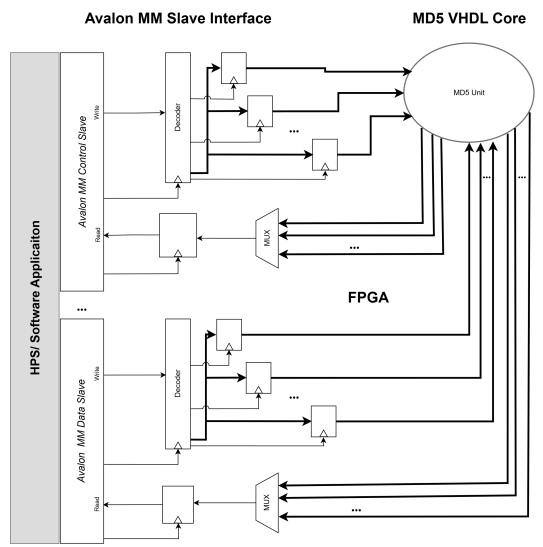
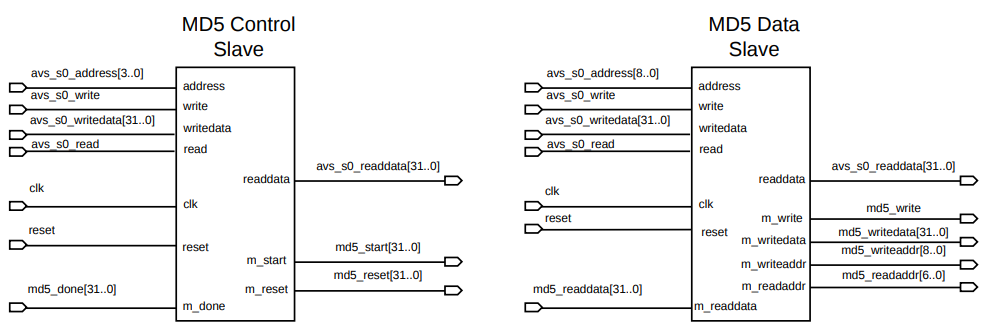
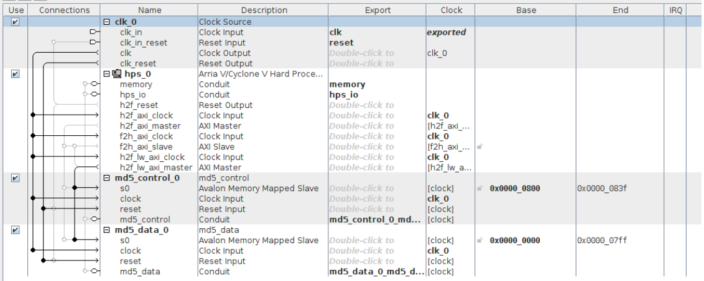
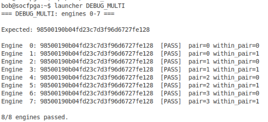
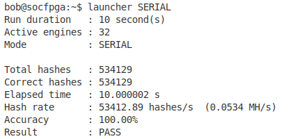
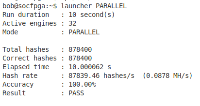

# HPS/FPGA-Based MD5 SoC

An HPS/FPGA-based MD5 System-on-Chip implemented on the DE1-SoC platform for a course called **Systems-on-Chip Design**.

This project integrates a provided **32-engine MD5 VHDL core** with custom **Avalon Memory-Mapped slave interfaces** and an **HPS controller application** running on Yocto Linux. The HPS sends a padded 512-bit MD5 message block to the FPGA, starts hashing, waits for completion, and reads back the resulting 128-bit digest.

---

## Project Overview

The goal of this project was to build a working MD5 SoC that combines:

- **Software control on the HPS**
- **Hardware-accelerated MD5 hashing on the FPGA**
- **Custom Avalon-MM interfaces** for communication between both sides

The final system supports:

- Correctness verification using a diagnostic mode
- Serial execution using one engine at a time
- Parallel execution using all 32 engines together
- Performance measurement using total hashes, elapsed time, and hash rate
- Quartus timing and resource analysis

---
## Tools and Technologies

This project was developed using the following hardware and software tools:

### Hardware Platform
- **DE1-SoC** development board
- **Cyclone V SoC FPGA**
- **ARM Cortex-A9 Hard Processor System (HPS)**

### Hardware Design
- **VHDL** for top-level integration and custom Avalon-MM slave design
- **Qsys / Platform Designer** for HPS and system integration
- **Quartus Prime** for synthesis, compilation, and resource/timing analysis

### Software
- **C** for the HPS controller application
- **Yocto Linux** running on the HPS
- **Memory-mapped I/O** through the lightweight HPS-to-FPGA bridge

### FPGA Interface
- **Avalon Memory-Mapped (Avalon-MM)** slave interfaces
- **Lightweight HPS-to-FPGA bridge** with 32-bit data width

### Provided Core
- **`md5_group`** provided MD5 hardware core containing 32 engines
## Key Features

- 32-engine MD5 hardware core
- Custom `md5_control` Avalon-MM slave
- Custom `md5_data` Avalon-MM slave
- HPS software in C running on Yocto Linux
- Serial and parallel benchmark modes
- Debug mode for digest verification
- Memory-mapped communication through the lightweight HPS-to-FPGA bridge

---

## System Architecture

The system is divided into three main parts:

### 1. HPS Software
The HPS runs a C application that:

- builds a padded 512-bit MD5 message block
- writes the message to the FPGA as 16 words of 32 bits
- controls engine reset/start signals
- waits for hashing completion
- reads back the 128-bit digest as 4 words of 32 bits
- checks correctness and records performance statistics

### 2. Custom Avalon-MM Interfaces
Two custom slave blocks were created:

- **`md5_control`**
  - handles reset, start, and done signals
- **`md5_data`**
  - handles message writes and digest reads

### 3. FPGA MD5 Core
The provided `md5_group` core contains **32 MD5 engines**, allowing the design to operate in either:

- **Serial mode**: one engine at a time
- **Parallel mode**: all 32 engines together

### Block Diagram



### Custom Avalon-MM Interfaces



## Qsys Integration

The HPS subsystem and the custom slave interfaces were integrated in Qsys. The signals needed to connect to the MD5 hashing core were exported as conduit signals and then connected at the top-level VHDL design.



---

## Hardware/Software Flow

1. The HPS prepares the input message.
2. The message is padded into one 512-bit MD5 block.
3. The block is split into **16 x 32-bit words**.
4. These words are written to the FPGA through `md5_data`.
5. The HPS asserts reset/start through `md5_control`.
6. The FPGA performs MD5 hashing.
7. The HPS waits for the done signal.
8. The digest is read back as **4 x 32-bit words**.
9. The digest is compared against the expected result.

---

## Input and Expected Output

This project used the input string:

```text
abc
```
The standard MD5 digest for "abc" is:
```
900150983cd24fb0d6963f7d28e17f72
```
Since the hardware/software interface uses little-endian 32-bit words, the software compares against:
```
98500190b04fd23c7d3f96d6727fe128
```
## Address Mapping

### Write Address Format

The write address sent through `md5_data` encodes:

- **bits [8:5]** = engine pair
- **bit [4]** = within-pair engine selection
- **bits [3:0]** = message word index

This format is required because the MD5 hardware groups engines in pairs, so the software must identify both the pair and the engine inside that pair.

### Read Address Format

The read address encodes:

- **bits [6:2]** = engine index
- **bits [1:0]** = digest word index

This allows one of the four 32-bit digest words to be selected for a given engine.

## Operating Modes

### `DEBUG_MULTI`

This diagnostic mode verifies correct digest generation across selected engines.

It was used to:

- check message addressing
- verify digest readback
- confirm correct engine selection inside each pair
- confirm that the corrected write-address format works properly

### `SERIAL`

In serial mode, the software:

- selects one engine
- loads the message
- starts hashing
- waits for completion
- reads back the digest
- checks correctness
- repeats for the next engine

### `PARALLEL`

In parallel mode, the software:

- loads all 32 engines
- starts all 32 engines together
- waits for all engines to finish
- reads back all digests
- checks correctness
- repeats for the benchmark duration

## Verification Output

The `DEBUG_MULTI` mode was used before the benchmark runs to confirm that the addressing and digest readback were working correctly across multiple engines.



All eight tested engines produced the expected digest and passed the correctness check.

## Benchmark Results

Both serial and parallel modes were benchmarked for approximately 10 seconds.

### Serial and Parallel Results

| Mode     | Time (s)   | Total Hashes | Correct Hashes | Hash Rate (hashes/s) |
|----------|------------|--------------|----------------|----------------------|
| Serial   | 10.000002  | 534129       | 534129         | 53412.89             |
| Parallel | 10.000062  | 878400       | 878400         | 87839.46             |

The hash rate was calculated as:

```text
Hash Rate = Total Hashes / Elapsed Time
```
### Terminal Output

<p align="left">   </p>

The parallel implementation achieved about **1.64×** the hash rate of the serial implementation.

## Quartus Results

### Timing Results

| Timing Model       | Maximum Frequency (MHz) |
|-------------------|--------------------------|
| Slow 1100mV 0°C   | 1237.62                  |
| Slow 1100mV 85°C  | 1184.83                  |

### Resource Usage

| Resource                   | Usage         |
|---------------------------|---------------|
| ALMs                      | 13,215 (~41%) |
| LABs                      | 1,930 (~60%)  |
| Dedicated Logic Registers | 14,713        |
| I/O Pins                  | 105 (~23%)    |

These results show that the design was synthesized successfully and stayed within reasonable device limits for the DE1-SoC FPGA.

## Conclusion

This project demonstrates a working HPS/FPGA-based MD5 SoC on the DE1-SoC platform. By combining a software controller on the HPS with a 32-engine MD5 hardware core on the FPGA, the design supports correctness verification, serial execution, and parallel execution within the same system.

The final implementation showed correct digest generation, successful hardware/software communication, and improved throughput in parallel mode compared to serial mode. Quartus timing and resource results also confirmed that the design was synthesized successfully and remained within practical device limits for the target platform.

## License

This repository is for academic and portfolio use. If you reuse this project, follow your institution's academic integrity policy and do not submit it as your own work.
